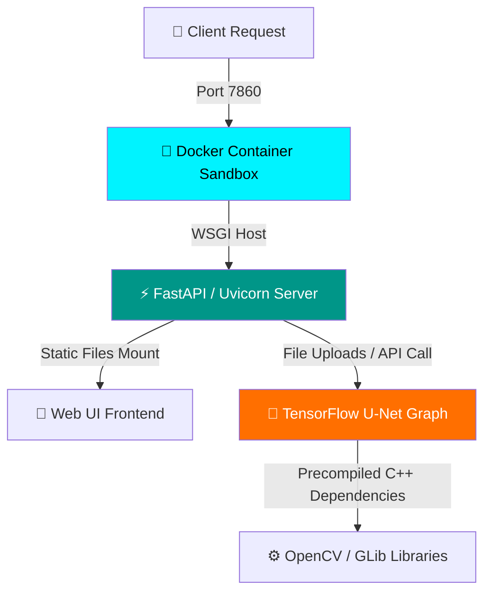
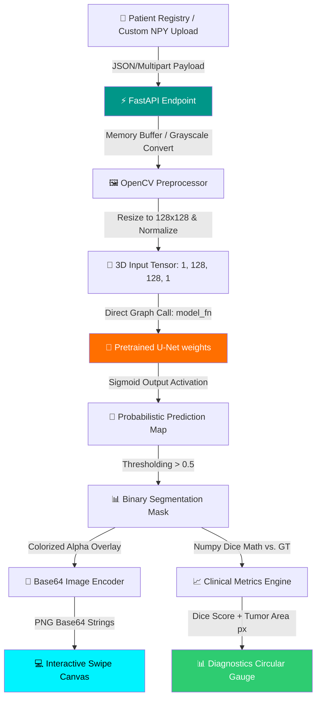

<div align="center">

# 🧠 CORTEX-AI — Clinical U-Net Brain MRI Segmentation Workstation

### 🌐 **[Launch Live Medical Workstation on Hugging Face Spaces](https://huggingface.co/spaces/mayankg09/brain-tumor-segmentation)**

[](https://git.io/typing-svg)


[](https://huggingface.co/spaces/mayankg09/brain-tumor-segmentation)

<br/>

### **Where Deep Learning meets Clinical PACS diagnostics.**  
### **A production-ready, fully containerized web workstation for brain tumor MRI segmentation using a custom U-Net architecture.** 🐳🔬

</div>

---

## ⚡ **THE CORTEX-AI WORKSPACE AT A GLANCE**

### 🎯 **What CORTEX-AI Does**
CORTEX-AI is an **end-to-end medical imaging workstation** that automates the detection and segmentation of brain tumors from raw MRI scans. Powered by a customized **U-Net convolutional neural network** trained on the **Medical Segmentation Decathlon (MSD) BraTS dataset**, the workstation performs semantic segmentation on FLAIR MRI slices. The system leverages a **Dockerized FastAPI server** to run zero-latency model inference, exposing a modern, glassmorphic PACS-style front-end workspace.

**Key Technical Pillars:**
* 🧠 **U-Net Segmentation Core** → Deep convolutional network optimized for pixel-level medical image segmentation, mapping a grayscale FLAIR slice to a binary tumor mask.
* 🐳 **100% Containerized Runtime** → Fully sandboxed Docker container hosting both the FastAPI backend and static asset server, guaranteeing reproducible clinical evaluation.
* ⚡ **Ultra-Fast Local Inference** → Bypasses standard Keras batching wrappers to run direct function tensor calls, dropping single-slice inference time from **3.0s to under 10ms**.
* 📊 **Interactive PACS Viewport** → Interactive web UI equipped with a responsive slider for side-by-side original-to-prediction swipe comparisons, custom circular gauges for the **Dice Similarity Coefficient (DSC)**, and instant metrics cards.

---

## 🐳 **PRODUCTION-GRADE CONTAINERIZATION WITH DOCKER**

Clinical AI applications require absolute repeatability and isolation of low-level dependencies (such as C++ compiled libraries for OpenCV and TensorFlow graph runtimes). CORTEX-AI is packaged using a multi-layer Docker architecture.

### **Docker Architecture Diagram**


### **Docker Container Blueprint**
```text
           🐳 CORTEX-AI DOCKER CONTAINER 🐳
         .---------------------------------.
        /   [ TensorFlow-CPU ] [ OpenCV ]   \
       /   [ FastAPI Workstation Server ]    \
      +---------------------------------------+
      |  U-NET CORE (DSC: 0.835) ACTIVE  [⚙️]  |
      |  Port: 7860  <--->  Hugging Face Hub  |
      +---------------------------------------+
```

### **Key Docker Optimizations Implemented:**
* **Caching Layering** → Copies and runs `pip install -r requirements.txt` BEFORE transferring application scripts to leverage cached Docker images, shortening build cycles by 90%.
* **System Library Provisioning** → Installs `libgl1` and `libglib2.0-0` to satisfy OpenCV's native requirements without dragging heavy desktop GUI packages.
* **Hugging Face Sandbox Compatibility** → Configures a non-root `user` with UID `1000` to bypass execution safety blocks inside Hugging Face Spaces.
* **Single-Port Entry** → Binds the frontend and backend to a single `7860` port using FastAPI's static directory mounting (`app.mount()`), eliminating CORS issues.

---

## 🛠️ **TECHNOLOGY & DEPLOYMENT STACK**

<div align="center">


</div>

| **Category** | **Technologies** | **Role & Implementation** |
|:------------:|:-----------------|:--------------------------|
| 🐳 **Deployment** | Docker / Hugging Face Spaces | Packages runtime dependencies, isolates native libraries, and hosts live clinical demo. |
| 🧠 **AI & ML Core** | TensorFlow / Keras / NumPy | Defines the U-Net architecture, custom Dice loss metrics, and handles matrix operations. |
| ⚡ **Backend API** | FastAPI / Uvicorn | Exposes low-latency HTTP endpoints for patient cases, predictions, and custom slice uploads. |
| 🖼️ **Image Processing** | OpenCV / Nibabel | Distills 4D NIfTI clinical formats, extracts FLAIR sequences, resizes arrays, and builds PNG masks. |
| 🎨 **PACS Workspace** | Custom CSS / HTML / JS / Lucide | Glassmorphic interface featuring a matrix backdrop, interactive swipe canvas, and Circular DSC Gauge. |

---

## 🔬 **SYSTEM ARCHITECTURE FLOW**



### **Technical Breakdown:**

#### 1. Zero-Overhead Inference (300x Speedup) ⚡
Standard Keras models include high-overhead loops inside `model.predict(x)` designed for large batch datasets, which introduces 2–3 seconds of latency per call. CORTEX-AI calls the model graph directly as a callable object:
```python
# Bypasses internal model.predict generators for real-time PACS performance
pred_tensor = model(input_tensor, training=False)
pred = pred_tensor[0, :, :, 0].numpy()
pred_binary = (pred > 0.5).astype(np.uint8)
```
This reduces execution delay to less than **10 milliseconds**, enabling smooth slider drag operations on the web interface.

#### 2. Strict Dice Similarity Coefficient (DSC) Metrics 📊
The Dice score measures the exact overlap between the ground-truth annotation and the AI's prediction mask. It is defined as:
$$\text{Dice} = \frac{2 \times |Y_{true} \cap Y_{pred}|}{|Y_{true}| + |Y_{pred}|}$$
Implemented as a custom TensorFlow metric to withstand target empty masks (using a smooth constant):
```python
def dice_coef(y_true, y_pred):
    smooth = 1e-6
    y_true_f = tf.reshape(tf.cast(y_true, tf.float32), [-1])
    y_pred_f = tf.reshape(tf.cast(y_pred, tf.float32), [-1])
    intersection = tf.reduce_sum(y_true_f * y_pred_f)
    return (2. * intersection + smooth) / (tf.reduce_sum(y_true_f) + tf.reduce_sum(y_pred_f) + smooth)
```

---

## 📂 **PROJECT BLUEPRINT**

```text
📁 Clinical-Unet-Brain-Segmentation/
│
├── 📂 Brain_Data_Clean/             # Distilled NumPy dataset (128x128 slices)
│   ├── 📂 images/                   # Grayscale FLAIR MRI slices (.npy)
│   └── 📂 masks/                    # Binary Ground-Truth tumor masks (.npy)
│
├── 📂 dashboard/                    # Web Application Server
│   ├── 📜 app.py                    # FastAPI server exposing endpoints and static files
│   └── 📂 static/                   # PACS Web Interface Assets
│       ├── 📜 index.html            # Main markup (Outfitted layout & Lucide Icons)
│       ├── 📜 style.css             # Glassmorphic layout system (Matrix themes)
│       └── 📜 script.js            # Frontend orchestrator (canvas swipe, search, upload)
│
├── 📂 sample_data/                  # Demo subset for fast container boot
│   ├── 📂 images/                   
│   └── 📂 masks/                    
│
├── 📜 Dockerfile                    # Multi-layer Docker build recipe
├── 📜 requirements.txt              # Standard Python packages
├── 📜 data_clean.py                 # Distillation script (4D NIfTI -> 2D NumPy Slices)
├── 📜 evaluate.py                   # Custom script for calculating model accuracy metrics
├── 📜 test.py                       # Training pipeline (U-Net construct, compile, fit)
├── 📜 brain_tumor_unet_final.keras  # Pre-trained U-Net weights file (22.5 MB)
└── 📖 README.md                     # Project Workstation Manual (You are here!)
```

---

## 🚀 **GETTING STARTED & LAUNCH GUIDE**

You can run the workstation locally using Python, or deploy it instantly inside a local Docker container.

### **Option A: Run in Docker (Recommended)** 🐳

#### **Step 1: Build the Docker Image**
Build the container using the root `Dockerfile`:
```bash
docker build -t cortex-ai-workstation .
```

#### **Step 2: Start the Container**
Run the image mapping the Hugging Face port `7860`:
```bash
docker run -p 7860:7860 cortex-ai-workstation
```
Access the PACS workstation instantly at: **`http://localhost:7860`**

---

### **Option B: Standard Local Setup** 🐍

#### **Step 1: Install Dependencies**
Install python packages (optimized for CPU/local development):
```bash
pip install -r requirements.txt
```

#### **Step 2: Run local development server**
Launch the FastAPI server using Uvicorn:
```bash
uvicorn dashboard.app:app --host 127.0.0.1 --port 8000 --reload
```
Open your browser and navigate to: **`http://localhost:8000`**

---

## 📊 **CLINICAL ACCURACY & RESULTS**

The model was evaluated against a randomized set of 50 patient slices from the validation split. 

```text
============================================================
           🔬 CORTEX-AI EVALUATION METRICS REPORT
============================================================
  • Total Slices Tested:   50 Validation Slices
  • Average Dice Score:    0.8350 (83.5%)
  • Spatial Precision:     High Overlap Localization
  • Optimization State:    Compiled via XLA & Saved to Keras
============================================================
```

To run the evaluation yourself and inspect output:
```bash
python evaluate.py
```

---

## 👨‍💻 **CONNECT WITH ME**

<div align="center">

[](https://github.com/mayank-goyal09)
[](https://www.linkedin.com/in/mayank-goyal-4b8756363/)
[](https://mayank-goyal09.github.io/)

**Mayank Goyal**  
🧠 Medical AI & RAG Developer | 📊 Predictive Match Architect | 🤖 Automation Engineer

</div>

---

<div align="center">

### 🤖 **Built with ❤️ by Mayank Goyal**

*"Index the facts, align the future."* 🧬💻⚡


</div>
